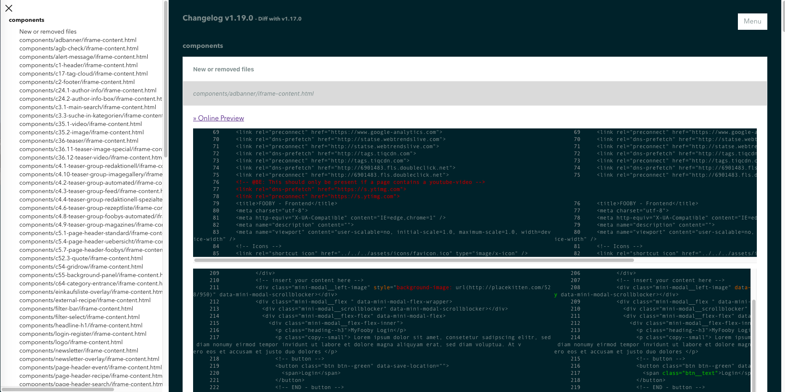

# Changelog Generator

Compare built preview markup of two tags from the same repository with [`icdiff`](https://github.com/jeffkaufman/icdiff) and output a HTML changelog page.

## Installation

Clone the repository and run `npm install`.

## Usage

Works by passing a repository url, preview generation command, preview folder and the tags to compare (old/new):

> $ npm start -- https://url-to-repository.git --old-tag=v1.18.0 --new-tag=v1.19.0 --preview-cmd="npm run preview" --preview-folder=build/preview

### Options

Optionally you can use following options:

* `--ignore-files`: Pass a regular expression to completly ignore changes from matching files (default `"(.js|.css|index.html)$"`)
* `--exclude-lines`: Pass regex to check for lines that should be ignored (default `''`)
* `--cols`: Set the number of characters per line (default `220`)
* `--context`: Set the number of lines to display before and after a comparison (default is `7`)
* `--preview-url`: Pass a url to generate links to an online preview
* `--preview-generate=false`: Prevent cloning the repository, checking out the tags and generating the previews (useful when if already done)
